# Role-Based Access Control (RBAC) — Architecture Reference

> **A production-grade, Two-Gate access control system built on Supabase (PostgreSQL + Row Level Security).**
>
> This document is a standalone reference for the RBAC architecture. It is designed to be portable — adapt the concepts, tables, and SQL to your own project.

---

## Table of Contents

1. [High-Level Architecture](#1-high-level-architecture)
2. [Role Definitions](#2-role-definitions)
3. [The Two-Gate Security Model](#3-the-two-gate-security-model)
4. [Permission Matrix](#4-permission-matrix)
5. [Folder-Level Access Levels](#5-folder-level-access-levels)
6. [Security Groups](#6-security-groups)
7. [Hierarchical Permission Inheritance](#7-hierarchical-permission-inheritance)
8. [Navigable Lineage Logic](#8-navigable-lineage-logic)
9. [Role Precedence Rules](#9-role-precedence-rules)
10. [Database Schema](#10-database-schema)
11. [Row Level Security (RLS) Policies](#11-row-level-security-rls-policies)
12. [Key SQL Functions](#12-key-sql-functions)
13. [Admin UI Patterns](#13-admin-ui-patterns)

---

## 1. High-Level Architecture

The system uses a **Two-Gate** model to control access to resources (e.g., photos, videos, documents). Before a user can see any asset, they must pass through two sequential authorization checks, unless they hold an administrative role that bypasses both gates.

```mermaid
flowchart TB
    User --> RoleCheck{Admin or Superadmin?}
    RoleCheck -->|Yes| FullAccess["See All Resources (Bypass)"]
    RoleCheck -->|No| Gate1

    subgraph "Gate 1: Module Access"
        Gate1["library_access table"] --> HasAccess{Has module access?}
    end

    subgraph "Gate 2: Resource Permissions"
        HasAccess -->|Yes| Gate2["resource_permissions table"]
        Gate2 --> HasPerm{Resource ID in allowed set?}
    end

    HasAccess -->|No| Denied["❌ Access Denied"]
    HasPerm -->|Yes| Granted["✅ See Resource + Children"]
    HasPerm -->|No| Hidden["🚫 Resource Hidden"]
```



**Key Principles:**
- **Defense in depth** — Two independent authorization layers.
- **Deny by default** — No access unless explicitly granted.
- **Database-enforced** — All access is enforced via PostgreSQL RLS policies, not just in application code.
- **Hierarchical** — Permissions cascade down a folder tree, unless explicitly broken.

---

## 2. Role Definitions

Roles are stored in a `user_profiles.role` column. The system supports **5 roles**:

| Role | Description | Content Visibility | Admin Access |
|------|-------------|-------------------|--------------|
| `user` | Default for new sign-ups | Granted only | ❌ |
| `viewer` | Read-only access | Granted only | ❌ |
| `editor` | Read + write access | Granted only | ❌ |
| `admin` | Staff-level visibility | **All resources** | ❌ |
| `superadmin` | Full system control | **All resources** | ✅ |

### Role Details

- **`user`** — Baseline role for automated sign-ups. Functionally similar to `viewer` but excluded from the manual role dropdown to prevent accidental demotion.
- **`viewer`** — Can view and download assets in folders they've been granted access to. No upload capability.
- **`editor`** — Can view, download, upload, and edit metadata in granted folders.
- **`admin`** — Bypasses both gates to see all content. **Cannot** access admin management tools (user management, settings, folder structure changes).
- **`superadmin`** — Full system control. Exclusive access to admin workspace, user management, permissions management, folder CRUD, and system configuration.

---

## 3. The Two-Gate Security Model

### Gate 1: Module Access (`library_access` table)

A binary "yes/no" check that determines whether a user can **enter** a specific module (e.g., "Photos", "Videos"). Think of it like a building key card.

| Behavior | Result |
|----------|--------|
| Record exists for user/group | ✅ Access granted |
| No record | ❌ Access denied |
| User is admin/superadmin | ✅ Automatic bypass |

**Checked via:** `has_library_access(library_type, user_id)` SQL function.

### Gate 2: Folder-Level ACL (`resource_permissions` table)

Once inside a module, visibility is restricted to specific branches of the folder hierarchy. Each permission grant specifies an access level.

| Access Level | View | Download | Upload | Edit Metadata |
|-------------|------|----------|--------|---------------|
| `read` | ✅ | ✅ | ❌ | ❌ |
| `write` | ✅ | ✅ | ✅ | ✅ |

**Enforced via:** RLS policies that call `get_user_navigable_folder_ids(user_id)`.

---

## 4. Permission Matrix

### Capabilities by Role

| Capability | user | viewer | editor | admin | superadmin |
|------------|------|--------|--------|-------|------------|
| View assets | ✅ Granted | ✅ Granted | ✅ Granted | ✅ All | ✅ All |
| Download assets | ✅ Granted | ✅ Granted | ✅ Granted | ✅ All | ✅ All |
| Upload assets | ❌ | ❌ | ✅ Granted | ✅ All | ✅ All |
| Edit metadata | ❌ | ❌ | ✅ Granted | ✅ All | ✅ All |
| Rename folder | ❌ | ❌ | ❌ | ❌ | ✅ |
| Create folder | ❌ | ❌ | ❌ | ❌ | ✅ |
| Delete folder | ❌ | ❌ | ❌ | ❌ | ✅ |
| Manage permissions | ❌ | ❌ | ❌ | ❌ | ✅ |
| Admin workspace | ❌ | ❌ | ❌ | ❌ | ✅ |
| User management | ❌ | ❌ | ❌ | ❌ | ✅ |
| System settings | ❌ | ❌ | ❌ | ❌ | ✅ |

> **"Granted"** = Only in folders where the user (or their group) has been explicitly granted access.
> **"All"** = Across all folders, regardless of explicit grants.

---

## 5. Folder-Level Access Levels

The `access_level` column on the permissions table controls what actions are available within a granted folder:

| Access Level | UI Label | View | Download | Upload | Edit |
|-------------|----------|------|----------|--------|------|
| `read` | Viewer | ✅ | ✅ | ❌ | ❌ |
| `write` | Editor | ✅ | ✅ | ✅ | ✅ |

> **Note:** Access levels are independent of the user's global role. An `editor` role with `read` access on a specific folder can only view/download in that folder.

---

## 6. Security Groups

Security groups provide **bulk permission management** — essential for scaling access control beyond individual user grants.

### Schema

```sql
-- Group definitions
CREATE TABLE security_groups (
  id UUID PRIMARY KEY DEFAULT gen_random_uuid(),
  name TEXT NOT NULL UNIQUE,
  description TEXT,
  created_at TIMESTAMPTZ DEFAULT now()
);

-- User-to-group membership
CREATE TABLE security_group_members (
  id UUID PRIMARY KEY DEFAULT gen_random_uuid(),
  group_id UUID REFERENCES security_groups(id) ON DELETE CASCADE,
  user_id UUID REFERENCES auth.users(id) ON DELETE CASCADE,
  created_at TIMESTAMPTZ DEFAULT now(),
  UNIQUE(group_id, user_id)
);
```

### Key Benefits

| Benefit | Example |
|---------|---------|
| **Bulk management** | Grant access to 50 photographers with a single permission |
| **Instant onboarding** | New users added to a group inherit all its permissions |
| **Easy revocation** | Remove group access = revoke for all members at once |

### Group–Library Access Inheritance Lock

When a user's library access (Gate 1) comes from a security group, the individual toggle is **locked** in the admin UI to prevent conflicting overrides. A "via group" label clarifies the source of access.

### When Groups Matter

| Role | Group Utility | Why |
|------|---------------|-----|
| `viewer` / `editor` / `user` | ✅ Essential | Groups define which libraries and folders they can access |
| `admin` / `superadmin` | ❌ Not needed | These roles bypass all permission checks |

---

## 7. Hierarchical Permission Inheritance

Permissions **flow down** the folder tree by default:

```
📁 Events (granted to: Press group → read)
├── 📁 Tournament A (inherited: Press → read)
│   └── 📁 Day 1 Gallery (inherited: Press → read)
└── 📁 Tournament B (inherited: Press → read)
```

### Breaking Inheritance

Set `inheritance_disabled = true` on any folder to stop the downward cascade:

```
📁 Events (granted to: Staff group → write)
├── 📁 Tournament A (inherited: Staff → write)
└── 📁 Confidential Event (inheritance_disabled = true)
    └── 📁 Photos (NOT accessible to Staff — requires explicit grant)
```

### Deepest Grant Wins

If a user has `read` at the top level but is explicitly granted `write` on a specific subfolder, they get `write` on that subfolder — the most specific grant takes precedence.

---

## 8. Navigable Lineage Logic

A critical UX consideration: if a user is granted access to a deeply nested folder, they must be able to **navigate to it** through the breadcrumb/sidebar tree, even though they don't have direct access to parent folders.

### How It Works

The function `get_user_navigable_folder_ids(user_id)` expands a user's granted folders in **two directions**:

| Direction | Purpose | Result |
|-----------|---------|--------|
| ⬆️ **Up (Parents)** | Breadcrumb / sidebar navigation | Folders are **visible** but not fully accessible |
| ⬇️ **Down (Children)** | Recursive inheritance | Folders are **fully accessible** |

**Effect:** Parents appear in navigation (as "pass-through" nodes); siblings remain completely hidden.

```sql
-- Simplified illustration
WITH RECURSIVE
  directly_permitted AS (
    -- All folders where user/group has explicit permission
    SELECT folder_id FROM resource_permissions
    WHERE (grantee_type = 'user' AND grantee_id = p_user_id)
       OR (grantee_type = 'group' AND grantee_id = ANY(user_groups))
  ),
  children AS (
    -- Recurse down (respecting inheritance_disabled)
    SELECT id FROM folders WHERE id IN (SELECT folder_id FROM directly_permitted)
    UNION
    SELECT f.id FROM folders f JOIN children c ON f.parent_id = c.id
    WHERE NOT COALESCE(f.inheritance_disabled, false)
  ),
  parents AS (
    -- Recurse up (for navigation)
    SELECT id, parent_id FROM folders
    WHERE id IN (SELECT folder_id FROM directly_permitted)
    UNION
    SELECT f.id, f.parent_id FROM folders f JOIN parents p ON f.id = p.parent_id
  )
SELECT DISTINCT id FROM (
  SELECT id FROM children UNION SELECT id FROM parents
) all_navigable;
```

---

## 9. Role Precedence Rules

The user's **global role always takes priority** over group and folder-level permissions:

```
1. Is user admin/superadmin? → YES → Full access (bypass all gates)
2. No? → Check library_access (Gate 1)
3. Has library access? → Check folder_permissions via groups + individual grants (Gate 2)
```

### Example

- **User A** has role `admin`.
- **User A** also belongs to a group with `read` access on a specific folder.
- **Result:** User A has full access to **all** folders. The group's restriction is irrelevant because the admin bypass fires first.

---

## 10. Database Schema

### Entity Relationship Diagram


### Core Tables

#### `user_profiles`
```sql
CREATE TABLE user_profiles (
  id UUID PRIMARY KEY REFERENCES auth.users(id),
  full_name TEXT,
  role TEXT NOT NULL DEFAULT 'user'
    CHECK (role IN ('user', 'viewer', 'editor', 'admin', 'superadmin')),
  created_at TIMESTAMPTZ DEFAULT now(),
  updated_at TIMESTAMPTZ DEFAULT now()
);
```

#### `library_access` (Gate 1)
```sql
CREATE TABLE library_access (
  id UUID PRIMARY KEY DEFAULT gen_random_uuid(),
  library_type TEXT NOT NULL,          -- e.g. 'photos', 'videos'
  grantee_type TEXT NOT NULL,          -- 'user' or 'group'
  grantee_id UUID NOT NULL,            -- FK to auth.users or security_groups
  access_level TEXT DEFAULT 'access',  -- Currently binary; column exists for future use
  created_at TIMESTAMPTZ DEFAULT now(),
  updated_at TIMESTAMPTZ DEFAULT now()
);
```

#### `resource_permissions` (Gate 2)
```sql
CREATE TABLE resource_permissions (
  id UUID PRIMARY KEY DEFAULT gen_random_uuid(),
  folder_id UUID NOT NULL REFERENCES folders(id),
  grantee_type TEXT NOT NULL,          -- 'user' or 'group'
  grantee_id UUID NOT NULL,            -- FK to auth.users or security_groups
  access_level TEXT NOT NULL DEFAULT 'read'
    CHECK (access_level IN ('read', 'write')),
  created_at TIMESTAMPTZ DEFAULT now(),
  updated_at TIMESTAMPTZ DEFAULT now()
);
```

#### `folders` (with inheritance flag)
```sql
CREATE TABLE folders (
  id UUID PRIMARY KEY DEFAULT gen_random_uuid(),
  name VARCHAR(255) NOT NULL,
  parent_id UUID REFERENCES folders(id),
  type TEXT DEFAULT 'folder',          -- e.g. 'collection', 'gallery'
  inheritance_disabled BOOLEAN DEFAULT false,
  created_at TIMESTAMPTZ DEFAULT now()
);
```

---

## 11. Row Level Security (RLS) Policies

RLS is the **enforcement layer** — it ensures authorization happens at the database level, not just in application code.

### Helper Function: `is_admin()`

```sql
CREATE OR REPLACE FUNCTION public.is_admin()
RETURNS boolean
LANGUAGE plpgsql
SECURITY DEFINER
SET search_path TO 'public'
AS $$
DECLARE
  current_role text;
BEGIN
  SELECT role INTO current_role
  FROM public.user_profiles
  WHERE id = auth.uid();

  RETURN current_role IN ('admin', 'superadmin');
END;
$$;
```

### Folder Visibility Policy

```sql
CREATE POLICY "Users can view navigable folders"
ON folders FOR SELECT
USING (
  -- Admin/Superadmin bypass: see all folders
  (EXISTS (
    SELECT 1 FROM user_profiles
    WHERE id = auth.uid()
    AND role IN ('admin', 'superadmin')
  ))
  OR
  -- Standard users: Gate 1 + Gate 2
  (
    has_library_access('photos', auth.uid())
    AND id = ANY(get_user_navigable_folder_ids(auth.uid()))
  )
);
```

### Asset Visibility Policy

```sql
CREATE POLICY "Users can view assets in accessible folders"
ON assets FOR SELECT
USING (
  is_admin()
  OR (
    has_library_access('photos', auth.uid())
    AND folder_id = ANY(get_user_accessible_folder_ids(auth.uid()))
  )
);
```

### Asset Upload Policy

```sql
CREATE POLICY "Users can upload to write-accessible folders"
ON assets FOR INSERT
WITH CHECK (
  is_admin()
  OR (
    folder_id IN (
      SELECT folder_id FROM resource_permissions
      WHERE access_level = 'write'
        AND (
          (grantee_type = 'user' AND grantee_id = auth.uid())
          OR (grantee_type = 'group' AND grantee_id IN (
            SELECT group_id FROM security_group_members WHERE user_id = auth.uid()
          ))
        )
    )
  )
);
```

---

## 12. Key SQL Functions

### `has_library_access(library_type, user_id)` — Gate 1 Check

Returns `true` if the user (directly or via group) has a record in `library_access`.

### `get_user_accessible_folder_ids(user_id)` — Gate 2 Direct Access

Returns an array of folder UUIDs the user can fully access (direct grants + inherited children). Respects `inheritance_disabled`.

### `get_user_navigable_folder_ids(user_id)` — Gate 2 + Navigation

Extends `accessible_folder_ids` by also including **parent folders** for navigation/breadcrumb purposes. This is the function used in RLS policies for folder visibility.

---

## 13. Admin UI Patterns

### Library Access Management (`/admin/library-access`)

A toggle-based UI for managing Gate 1:

| Element | Behavior |
|---------|----------|
| **Toggle ON** | Creates a `library_access` record → user can enter module |
| **Toggle OFF** | Deletes the record → user loses module access |
| **Admin/Superadmin rows** | Greyed out with "bypass" label — they always have access |
| **Group-inherited access** | Disabled toggle with "via group" label — managed at group level |

### Folder Permission Management

A per-folder UI (typically accessed via a "Manage Access" button on a folder):

- **Grant Access:** Select user/group → choose `read` or `write` → save.
- **Inheritance Indicator:** Shows whether permissions flow from a parent.
- **Break Inheritance:** Toggle to stop permission cascade for a specific branch.

---

## Access Control Security Layers (Summary)

| Layer | Responsibility | Mechanism |
|-------|---------------|-----------|
| **1. Global Role** | System-wide capability | `admin`/`superadmin` bypass all checks |
| **2. Security Groups** | Batch permission inheritance | Group membership → inherited grants |
| **3. Library Access** | Gate 1: Module entry | Binary permit in `library_access` table |
| **4. Folder Permissions** | Gate 2: Granular ACL | `read`/`write` on specific folder branches |

---

## Adapting for Your Project

To port this system to a new Supabase project:

1. **Create the tables** from [Section 10](#10-database-schema).
2. **Implement the SQL functions** (`is_admin`, `has_library_access`, `get_user_navigable_folder_ids`).
3. **Enable RLS** on all tables and add the policies from [Section 11](#11-row-level-security-rls-policies).
4. **Build the admin UI** for managing library access toggles and folder permission grants.
5. **Wire up frontend checks** — use the user's role from `user_profiles` to conditionally render UI elements (e.g., hide admin buttons for non-superadmins).

> **Golden Rule:** Never trust the frontend for security. RLS policies are the ground truth — the UI just reflects what the database already enforces.
