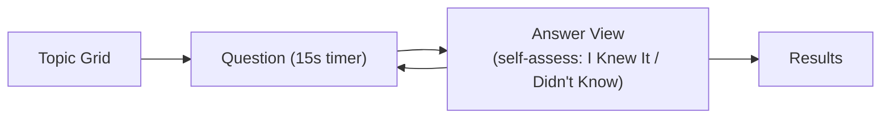
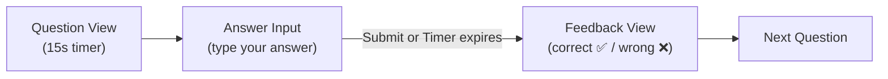
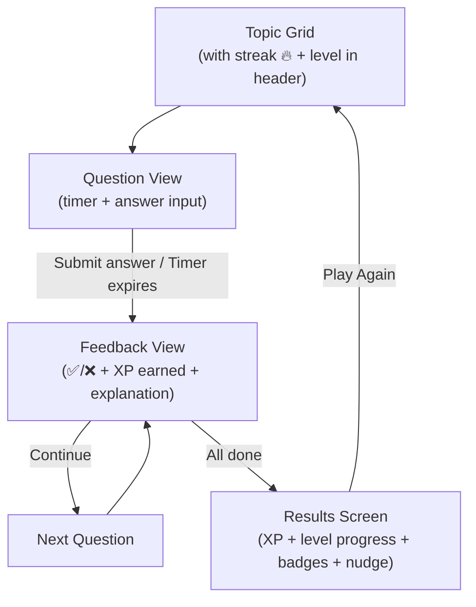

# FreeQuiz Gamification — Implementation Plan

> **Phase 12: FreeQuiz Gamification & Duolingo-Style Answers**
>
> Transform the FreeQuiz from self-assessment to interactive answer input, add lightweight gamification (XP, streaks, badges), and create natural signup motivation — all **frontend-only**, no backend/DB changes.

---

## 1. Current State Summary

### User Flow (As-Is)


### What Works
- Jeopardy grid, streak counter, score bounce, best score in `localStorage`, share score, question count selector (9/18/27)

### What's Weak
| Problem | Impact |
|---|---|
| **Self-assessment honesty gap** | "I Knew It" has zero accountability — users can always claim correct |
| **No answer input** | User never types or selects an answer — passive experience |
| **No progression** | Every session is identical — no sense of advancement |
| **Weak signup CTA** | Single text line, easy to ignore |
| **No return hook** | Nothing pulls the user back tomorrow |

---

## 2. What We're Building

Three focused changes, no backend required:

| Change | Description |
|---|---|
| **A. Duolingo-Style Answer Input** | Replace self-assessment with a text input that fuzzy-matches against the correct answer |
| **B. Lightweight Gamification** | XP, levels, daily streak, achievement badges — all in `localStorage` |
| **C. Contextual Signup Nudges** | Emotionally-timed, dismissible toasts at peak moments (level-up, badge, streak) |

> [!IMPORTANT]
> **No backend changes.** All gamification state lives in `localStorage` for anonymous users and uses the existing [recordAttempt](file:///Users/shobha/Documents/Python_Learn/Qwizzeria_WebApp/packages/supabase-client/src/questions.js#122-142) API (which already accepts `is_correct`) for logged-in users. No new DB tables, RPCs, or migrations.

---

## 3A. Duolingo-Style Answer Input

### How It Works

Replace the current "Question → Reveal → Self-Assess" flow with:



**Answer matching uses client-side fuzzy comparison:**

```
User types: "nile"
Correct answer: "The Nile River"
→ Match ✅ (normalized substring match)
```

### Answer Matching Rules

Simple, predictable, generous matching — not AI:

1. **Normalize** both strings: lowercase, trim, strip leading "the/a/an", remove punctuation
2. **Exact match** after normalization → ✅ correct
3. **Substring containment** — if the normalized user input is contained in the normalized answer OR vice versa → ✅ correct (handles "nile" vs "the nile river")
4. **Levenshtein distance** ≤ 2 for short answers (≤ 10 chars), ≤ 3 for longer answers → ✅ correct (handles typos: "einsten" → "einstein")
5. **Otherwise** → ❌ wrong, show correct answer

> [!NOTE]
> This is deliberately generous. The goal is engagement, not exam-level strictness. We want users to feel rewarded for knowing the answer even if they don't spell it perfectly.

### Fallback: "I Was Close" Button

On the feedback screen when marked wrong, show a small **"I was close"** button that lets the user self-override to correct. This preserves the safety valve from the old self-assessment system while making the default path interactive.

### UI Design

**Answer Input Phase** (replaces current QuestionView actions area):
```
┌──────────────────────────────────────┐
│  [Timer Ring]              10 pts    │
│                                      │
│  What river is the longest in        │
│  Africa?                             │
│                                      │
│  ┌──────────────────────────┐       │
│  │ Type your answer...      │  [→]  │
│  └──────────────────────────┘       │
│                                      │
│  [Skip]              [Back to Grid]  │
└──────────────────────────────────────┘
```

**Feedback Phase** (replaces current FreeAnswerView):
```
┌──────────────────────────────────────┐
│  ✅ Correct!              +30 XP     │
│                                      │
│  The Nile River                      │
│  The Nile is approximately 6,650    │
│  km long...                          │
│                                      │
│  Your answer: "nile" ✓              │
│                                      │
│         [ Continue → ]               │
└──────────────────────────────────────┘
```

Wrong answer variant:
```
┌──────────────────────────────────────┐
│  ❌ Not quite                        │
│                                      │
│  The Nile River                      │
│  The Nile is approximately 6,650    │
│  km long...                          │
│                                      │
│  Your answer: "amazon"              │
│                                      │
│  [ Continue → ]    [ I was close ]   │
└──────────────────────────────────────┘
```

### File Changes

| File | Change |
|---|---|
| `utils/answerMatcher.js` | **New** — `matchAnswer(userInput, correctAnswer)` returns `{ isMatch, similarity }` |
| [components/QuestionView.jsx](file:///Users/shobha/Documents/Python_Learn/Qwizzeria_WebApp/apps/quiz-app/src/components/QuestionView.jsx) | Add text input field + submit button below question text. Keep timer. Remove "Reveal Answer" as primary action. |
| [components/FreeAnswerView.jsx](file:///Users/shobha/Documents/Python_Learn/Qwizzeria_WebApp/apps/quiz-app/src/components/FreeAnswerView.jsx) | Rename to `FreeAnswerFeedback.jsx`. Show correct/wrong badge, user's typed answer, correct answer, explanation. Add "I was close" override button on wrong answers. Remove "I Knew It" / "Didn't Know" self-assess buttons. |
| [components/free/freeQuizReducer.js](file:///Users/shobha/Documents/Python_Learn/Qwizzeria_WebApp/apps/quiz-app/src/components/free/freeQuizReducer.js) | Add `SUBMIT_ANSWER` action. New state field: `userAnswer` (string). Compute `isCorrect` via `matchAnswer`. Phase flow: `question → feedback → (next question or results)`. |
| [components/FreeQuiz.jsx](file:///Users/shobha/Documents/Python_Learn/Qwizzeria_WebApp/apps/quiz-app/src/components/FreeQuiz.jsx) | Wire new `handleSubmitAnswer(text)` + `handleOverrideCorrect()`. Remove `handleRevealAnswer` + `handleSelfAssessAndNext`. |

---

## 3B. Lightweight Gamification

### XP System

| XP Source | Amount | Notes |
|---|---|---|
| Correct answer | `question.points` (10/20/30) | Same as current score |
| Speed bonus | `+5` | Answered in < 5 seconds |
| Streak bonus | `streak × 3` | Cumulative, resets on wrong |
| Session complete | `+25` | Finishing > abandoning |

### Levels

10 levels with quiz-themed titles. XP thresholds are modest so users level up within a few sessions:

| Level | XP | Title |
|---|---|---|
| 1 | 0 | Curious Cat |
| 2 | 100 | Trivia Dabbler |
| 3 | 300 | Fact Finder |
| 4 | 600 | Knowledge Seeker |
| 5 | 1,000 | Quiz Enthusiast |
| 6 | 1,500 | Brainy Bunch |
| 7 | 2,500 | Trivia Titan |
| 8 | 4,000 | Quiz Maestro |
| 9 | 6,000 | Encyclopedia |
| 10 | 10,000 | Qwizzeria Legend |

### Daily Streak

- Track consecutive days played: `{ count: 5, lastPlayDate: "2026-03-21" }`.
- Show 🔥 icon + count in the header.
- Resets if user misses a day.

### Badges (6 total — keep it simple)

| Badge | Key | Condition |
|---|---|---|
| 🌟 First Steps | `first_steps` | Complete first quiz |
| 🎯 Sharp Shooter | `sharp_shooter` | 100% accuracy in a session |
| 🔥 On Fire | `on_fire` | 5+ streak in a single session |
| 🧠 Big Brain | `big_brain` | Score 90%+ on 27 questions |
| 📅 Dedicated | `dedicated` | 7-day play streak |
| 👑 Legend | `legend` | Reach level 10 |

### localStorage Schema

```javascript
// Existing (unchanged)
qwizzeria_free_best_score     // { score, maxScore, pct }
qwizzeria_free_play_count     // number

// New
qwizzeria_xp                  // number
qwizzeria_daily_streak        // { count: number, lastPlayDate: "YYYY-MM-DD" }
qwizzeria_badges              // string[] — e.g. ["first_steps", "on_fire"]
qwizzeria_total_correct       // number (lifetime correct answers)
```

### File Changes

| File | Change |
|---|---|
| `utils/gamification.js` | **New** — Pure functions: `calculateXP()`, `getLevel()`, `getLevelTitle()`, `checkBadges()`, `updateStreak()`, `getStreak()` |
| [utils/freeQuizStorage.js](file:///Users/shobha/Documents/Python_Learn/Qwizzeria_WebApp/apps/quiz-app/src/utils/freeQuizStorage.js) | Add: `getXP/setXP`, `getStreak/setStreak`, `getBadges/addBadge`, `getTotalCorrect/incrementTotalCorrect` |
| [components/free/freeQuizReducer.js](file:///Users/shobha/Documents/Python_Learn/Qwizzeria_WebApp/apps/quiz-app/src/components/free/freeQuizReducer.js) | Track `xpEarned` per question and `sessionXP` total in state |
| [components/free/FreeQuizHeader.jsx](file:///Users/shobha/Documents/Python_Learn/Qwizzeria_WebApp/apps/quiz-app/src/components/free/FreeQuizHeader.jsx) | Show: XP bar (thin progress), level number, streak 🔥 count |
| [components/free/FreeQuizResults.jsx](file:///Users/shobha/Documents/Python_Learn/Qwizzeria_WebApp/apps/quiz-app/src/components/free/FreeQuizResults.jsx) | Show: total XP earned this session, level progress bar, new badges earned, level-up celebration |
| [styles/FreeQuiz.css](file:///Users/shobha/Documents/Python_Learn/Qwizzeria_WebApp/apps/quiz-app/src/styles/FreeQuiz.css) | Add styles for XP bar, streak badge, level indicator, badge cards |

---

## 3C. Contextual Signup Nudges

### Trigger Moments

Non-blocking, dismissible toasts at emotionally-appropriate moments. Shown only to anonymous users (`!user`).

| Trigger | Message | When |
|---|---|---|
| **First quiz complete** | "Nice! Sign up free to save your progress." | Results screen, session 1 |
| **New personal best** | "New best! Create an account so you never lose it." | Results screen |
| **Level up** | "Level 4: Knowledge Seeker 🧠 — Sign up to keep your rank." | Results screen |
| **Badge earned** | "You earned Sharp Shooter 🎯! Sign up to display it." | Results screen |
| **3+ plays** | "You've played {n} quizzes — sign up to track everything." | Results screen (existing, improved) |
| **Streak at risk** | "Your 5-day streak is stored locally. Sign up to protect it." | Pre-quiz, if streak ≥ 3 |

> [!WARNING]
> Only **one** nudge per session. Priority: badge > level-up > personal best > play count > streak. Never interrupt gameplay.

### File Changes

| File | Change |
|---|---|
| `components/free/SignupNudge.jsx` | **New** — Dismissible toast component. Receives `message`, `onSignUp`, `onDismiss`. Renders at bottom of results screen. |
| [components/free/FreeQuizResults.jsx](file:///Users/shobha/Documents/Python_Learn/Qwizzeria_WebApp/apps/quiz-app/src/components/free/FreeQuizResults.jsx) | Add `SignupNudge` with trigger logic. Show at most one nudge per session. |
| [styles/FreeQuiz.css](file:///Users/shobha/Documents/Python_Learn/Qwizzeria_WebApp/apps/quiz-app/src/styles/FreeQuiz.css) | Add styles for nudge toast (slide-up, dismissible) |

---

## 4. Revised User Flow



### Phase Changes in Reducer

**Current phases:** `loading → grid → question → answer → results`

**New phases:** `loading → grid → question → feedback → results`

- `question`: Shows question text + answer input field + timer
- `feedback`: Shows correct/wrong + user's answer + correct answer + XP earned
- Removed: `answer` phase (replaced by `feedback`)

---

## 5. Detailed File Plan

### New Files (4)

| # | File | Purpose | Size Est. |
|---|---|---|---|
| 1 | [utils/answerMatcher.js](file:///Users/shobha/Documents/Python_Learn/Qwizzeria_WebApp/apps/quiz-app/src/utils/answerMatcher.js) | `matchAnswer(input, correct)` — normalize, compare, Levenshtein | ~60 lines |
| 2 | [utils/gamification.js](file:///Users/shobha/Documents/Python_Learn/Qwizzeria_WebApp/apps/quiz-app/src/utils/gamification.js) | `calculateXP()`, `getLevel()`, `getLevelTitle()`, `checkBadges()`, `updateStreak()` — pure functions | ~80 lines |
| 3 | [components/free/SignupNudge.jsx](file:///Users/shobha/Documents/Python_Learn/Qwizzeria_WebApp/apps/quiz-app/src/components/free/SignupNudge.jsx) | Dismissible contextual signup toast | ~40 lines |
| 4 | [utils/answerMatcher.test.js](file:///Users/shobha/Documents/Python_Learn/Qwizzeria_WebApp/apps/quiz-app/src/utils/answerMatcher.test.js) | Tests for answer matching edge cases | ~80 lines |

### Modified Files (7)

| # | File | Changes |
|---|---|---|
| 5 | [utils/freeQuizStorage.js](file:///Users/shobha/Documents/Python_Learn/Qwizzeria_WebApp/apps/quiz-app/src/utils/freeQuizStorage.js) | Add XP, streak, badges, totalCorrect get/set functions (~40 new lines) |
| 6 | [components/free/freeQuizReducer.js](file:///Users/shobha/Documents/Python_Learn/Qwizzeria_WebApp/apps/quiz-app/src/components/free/freeQuizReducer.js) | Replace `REVEAL_ANSWER` + `ANSWER_AND_NEXT` with `SUBMIT_ANSWER` + `CONTINUE`. Add `userAnswer`, `isCorrect`, `xpEarned`, `questionStartTime` to state. Rename `answer` phase → `feedback`. |
| 7 | [components/QuestionView.jsx](file:///Users/shobha/Documents/Python_Learn/Qwizzeria_WebApp/apps/quiz-app/src/components/QuestionView.jsx) | Add answer text input + submit button. On timer expire, auto-submit empty answer (= wrong). Keep existing timer ring, media support. Add `onSubmitAnswer(text)` prop, remove `onRevealAnswer` usage from FreeQuiz. **Keep `onRevealAnswer` prop** for backward compat with non-free quiz modes (Host, Packs). |
| 8 | [components/FreeAnswerView.jsx](file:///Users/shobha/Documents/Python_Learn/Qwizzeria_WebApp/apps/quiz-app/src/components/FreeAnswerView.jsx) | Redesign as feedback view: show ✅/❌ result, user's answer, correct answer, explanation, XP earned, "I was close" button (on wrong). Remove "I Knew It" / "Didn't Know" buttons. |
| 9 | [components/FreeQuiz.jsx](file:///Users/shobha/Documents/Python_Learn/Qwizzeria_WebApp/apps/quiz-app/src/components/FreeQuiz.jsx) | Wire `handleSubmitAnswer(text)` → reducer. Wire `handleOverrideCorrect()`. Add gamification: compute session XP, check badges, update streak on results. Pass XP/badge/level data to results. |
| 10 | [components/free/FreeQuizResults.jsx](file:///Users/shobha/Documents/Python_Learn/Qwizzeria_WebApp/apps/quiz-app/src/components/free/FreeQuizResults.jsx) | Add: XP earned this session, level progress bar with title, badges earned (if any), `SignupNudge` for anon users. |
| 11 | [components/free/FreeQuizHeader.jsx](file:///Users/shobha/Documents/Python_Learn/Qwizzeria_WebApp/apps/quiz-app/src/components/free/FreeQuizHeader.jsx) | Add: daily streak 🔥 counter, level badge. |

### Style Changes (2)

| # | File | Changes |
|---|---|---|
| 12 | [styles/FreeQuiz.css](file:///Users/shobha/Documents/Python_Learn/Qwizzeria_WebApp/apps/quiz-app/src/styles/FreeQuiz.css) | Add: XP bar, streak badge, level indicator, signup nudge toast, badge cards on results |
| 13 | [styles/AnswerView.css](file:///Users/shobha/Documents/Python_Learn/Qwizzeria_WebApp/apps/quiz-app/src/styles/AnswerView.css) | Update: feedback styles (correct/wrong states, user answer display, "I was close" button, XP earned animation) |

---

## 6. Implementation Steps

### Step 1: Answer Matcher Utility
Create `utils/answerMatcher.js` with `matchAnswer(userInput, correctAnswer)`.
- Pure function, no side effects, fully testable
- Returns `{ isMatch: boolean, normalizedInput: string, normalizedAnswer: string }`
- Write `utils/answerMatcher.test.js` covering: exact match, case insensitive, strip articles, substring, Levenshtein, empty input

### Step 2: Gamification Utility
Create `utils/gamification.js` with pure functions:
- `calculateXP({ isCorrect, points, timeSpentMs, streak })` → `number`
- `getLevel(totalXP)` → `number`
- `getLevelTitle(level)` → `string`
- `checkNewBadges({ sessionResults, totalCorrect, bestStreak, playCount, level, existingBadges })` → `string[]`
- `updateStreak(currentStreak)` → `{ count, lastPlayDate }`

### Step 3: Expand freeQuizStorage
Add to [utils/freeQuizStorage.js](file:///Users/shobha/Documents/Python_Learn/Qwizzeria_WebApp/apps/quiz-app/src/utils/freeQuizStorage.js):
- `getXP() / addXP(amount)`
- `getStreak() / saveStreak(streakObj)`
- `getBadges() / addBadges(newBadgeKeys[])`
- `getTotalCorrect() / addTotalCorrect(count)`

### Step 4: Update Reducer
Modify [components/free/freeQuizReducer.js](file:///Users/shobha/Documents/Python_Learn/Qwizzeria_WebApp/apps/quiz-app/src/components/free/freeQuizReducer.js):
- Add `SUBMIT_ANSWER` action — takes `{ userAnswer, isCorrect, xpEarned, overridden? }`
- Add `CONTINUE` action — advance to next question or results
- Add `OVERRIDE_CORRECT` action — flip current answer to correct
- Rename `answer` phase → `feedback`
- Add to state: `userAnswer`, `isCorrect` (per-question), `questionXP`, `sessionXP`
- Remove: `REVEAL_ANSWER`, `ANSWER_AND_NEXT`

### Step 5: Update QuestionView
Modify [components/QuestionView.jsx](file:///Users/shobha/Documents/Python_Learn/Qwizzeria_WebApp/apps/quiz-app/src/components/QuestionView.jsx):
- Add answer text input with submit button below question text
- New prop: `onSubmitAnswer(text)` — called on submit or Enter
- Prop: `showAnswerInput` (boolean, default false) — only FreeQuiz enables it
- On timer expire with answer input: auto-submit whatever is typed (empty = wrong)
- Keep `onRevealAnswer` for backward compat with Host/Pack modes
- Input: auto-focus, placeholder "Type your answer...", max 200 chars
- Submit on Enter key

### Step 6: Update FreeAnswerView (→ Feedback View)
Modify [components/FreeAnswerView.jsx](file:///Users/shobha/Documents/Python_Learn/Qwizzeria_WebApp/apps/quiz-app/src/components/FreeAnswerView.jsx):
- New props: `isCorrect`, `userAnswer`, `xpEarned`, `onContinue`, `onOverride`
- Show: ✅ Correct! or ❌ Not quite
- Show: user's typed answer + the correct answer + explanation
- Show: "+30 XP" earned animation
- On wrong: show "I was close" button → calls `onOverride()`
- On correct or after override: single "Continue →" button
- Keyboard: Enter = Continue, Escape = Back to Grid

### Step 7: Update FreeQuiz Orchestrator
Modify [components/FreeQuiz.jsx](file:///Users/shobha/Documents/Python_Learn/Qwizzeria_WebApp/apps/quiz-app/src/components/FreeQuiz.jsx):
- `handleSubmitAnswer(text)`:
  1. Call `matchAnswer(text, currentQuestion.answer)` → `isMatch`
  2. Call `calculateXP(...)` → `xpEarned`
  3. Dispatch `SUBMIT_ANSWER` with `{ userAnswer: text, isCorrect: isMatch, xpEarned }`
  4. Call [recordAttempt(...)](file:///Users/shobha/Documents/Python_Learn/Qwizzeria_WebApp/packages/supabase-client/src/questions.js#122-142) for logged-in users (already does `isCorrect`)
- `handleContinue()` → dispatch `CONTINUE` (moves to next question or results)
- `handleOverrideCorrect()`:
  1. Dispatch `OVERRIDE_CORRECT` (flips isCorrect, adds points + XP)
  2. Re-record attempt with corrected `isCorrect` if logged in
- On results phase: compute session totals, update localStorage (XP, streak, badges), pass to results component

### Step 8: Update FreeQuizHeader
Modify [components/free/FreeQuizHeader.jsx](file:///Users/shobha/Documents/Python_Learn/Qwizzeria_WebApp/apps/quiz-app/src/components/free/FreeQuizHeader.jsx):
- Add streak 🔥 counter (reads from `getStreak()`)
- Add level badge (e.g., "Lv.4")
- Keep existing: score, streak badge, children pass-through

### Step 9: Update FreeQuizResults
Modify [components/free/FreeQuizResults.jsx](file:///Users/shobha/Documents/Python_Learn/Qwizzeria_WebApp/apps/quiz-app/src/components/free/FreeQuizResults.jsx):
- Add XP section: "Session XP: +185" with level progress bar
- Add level display with title: "Level 4: Knowledge Seeker"
- If leveled up: show "🎉 Level Up!" celebration
- If badges earned: show badge cards
- Add `SignupNudge` for anonymous users (pick highest-priority trigger)
- Review list: show user's answer vs correct answer (instead of just correct/wrong)

### Step 10: Create SignupNudge
Create `components/free/SignupNudge.jsx`:
- Props: `message`, `onSignUp`, `onDismiss`
- Renders as a card at the bottom of results (not a floating toast — simpler)
- Single dismiss with ✕ button
- "Sign Up Free" button → navigates to `/` (triggers login modal)
- Auto-dismiss after 10 seconds

### Step 11: Styles
Update CSS files:
- [FreeQuiz.css](file:///Users/shobha/Documents/Python_Learn/Qwizzeria_WebApp/apps/quiz-app/src/styles/FreeQuiz.css): XP bar, streak 🔥, level badge, signup nudge card, badge tiles
- `AnswerView.css`: feedback states (correct green glow, wrong red border), user answer display, "I was close" button, XP earned micro-animation

### Step 12: Tests & QA
- `answerMatcher.test.js` — unit tests for all matching rules
- Manual regression: ensure Host Quiz and Pack Play modes still work (they use `onRevealAnswer`, not `onSubmitAnswer`)
- Run full test suite: `cd apps/quiz-app && npx vitest run`
- Verify: timer expire → auto-submit, keyboard shortcuts, skip, quit, play again
- Verify: XP/streak/badges persist across page reloads via localStorage

---

## 7. What We're NOT Doing

Keeping scope tight by explicitly excluding:

| Excluded | Reason |
|---|---|
| Backend DB changes | Constraint: frontend-only |
| Daily Challenge system | Too complex for initial phase |
| Visual share card (canvas) | Polish item for later |
| Category mastery tracking | Adds complexity; can layer on later |
| Pre-Game Hub screen | XP bar in header is sufficient for now |
| Blurred leaderboard teaser | Requires backend rank data |
| Anonymous-to-account migration | Requires new RPC — future phase |

---

## 8. Backward Compatibility

> [!IMPORTANT]
> The Duolingo-style answer input is **only** for FreeQuiz. Host Quiz and Pack Play modes continue to use `onRevealAnswer` (self-assessment / host-scored). QuestionView gains a new `showAnswerInput` prop that defaults to `false`.

| Mode | Answer Flow | Changed? |
|---|---|---|
| **FreeQuiz** | Type answer → fuzzy match → feedback | ✅ Changed |
| **Pack Play (Jeopardy)** | View question → Reveal Answer → self-assess | ❌ Unchanged |
| **Pack Play (Sequential)** | View question → Reveal Answer → self-assess | ❌ Unchanged |
| **Host Quiz** | Host reveals → awards points to participants | ❌ Unchanged |

---

## 9. Success Criteria

| Metric | How to Verify |
|---|---|
| Answer matching works for common cases | `answerMatcher.test.js` passes |
| XP/level/streak/badges persist across reloads | Manual test with localStorage |
| Existing modes (Host, Packs) unaffected | Existing test suite passes + manual check |
| No backend changes needed | No files modified in `packages/supabase-client/src/` or `supabase/` |
| Clean, maintainable code | Follows CLAUDE.md patterns: `@/` imports, BEM CSS, reducer pattern, small focused files |
